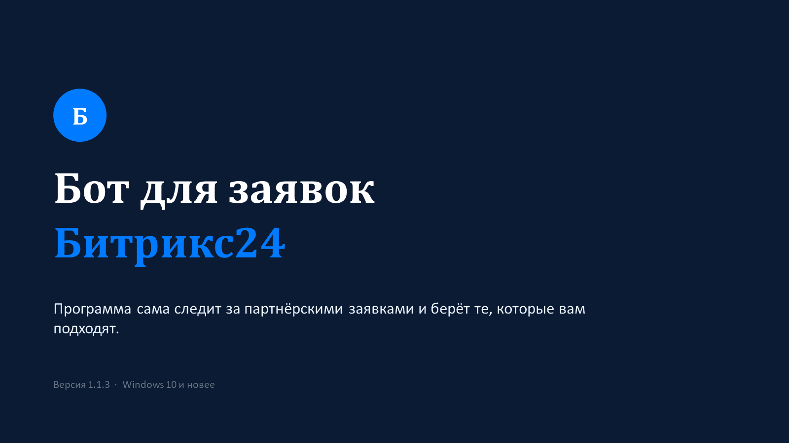
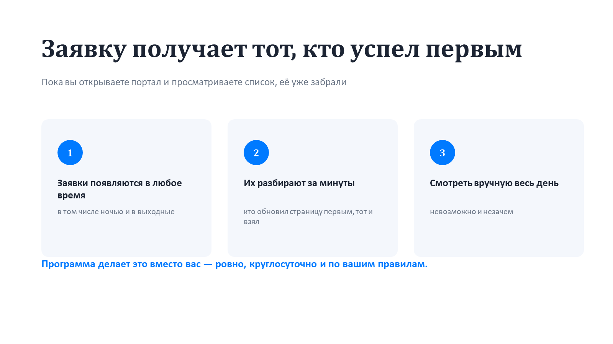
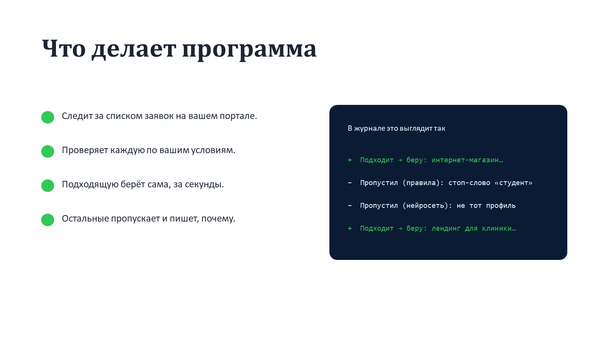
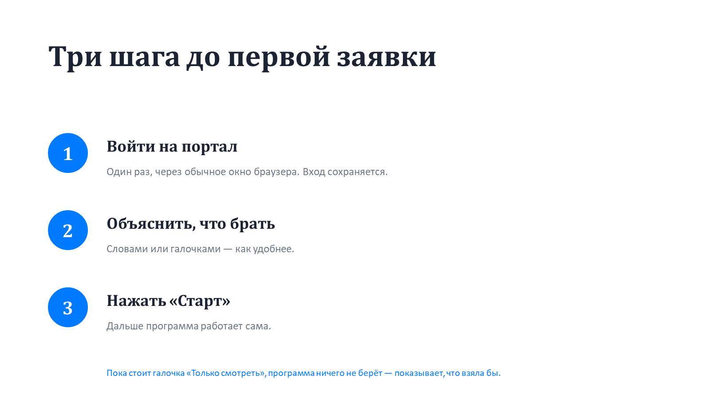
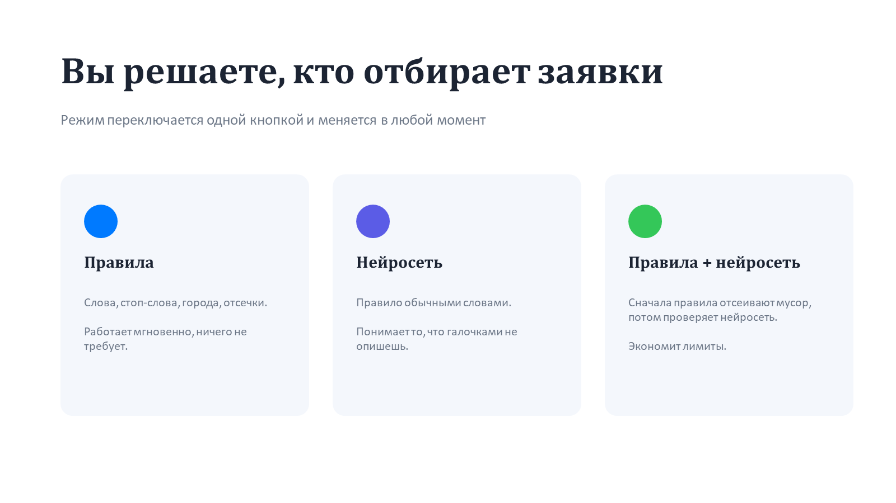
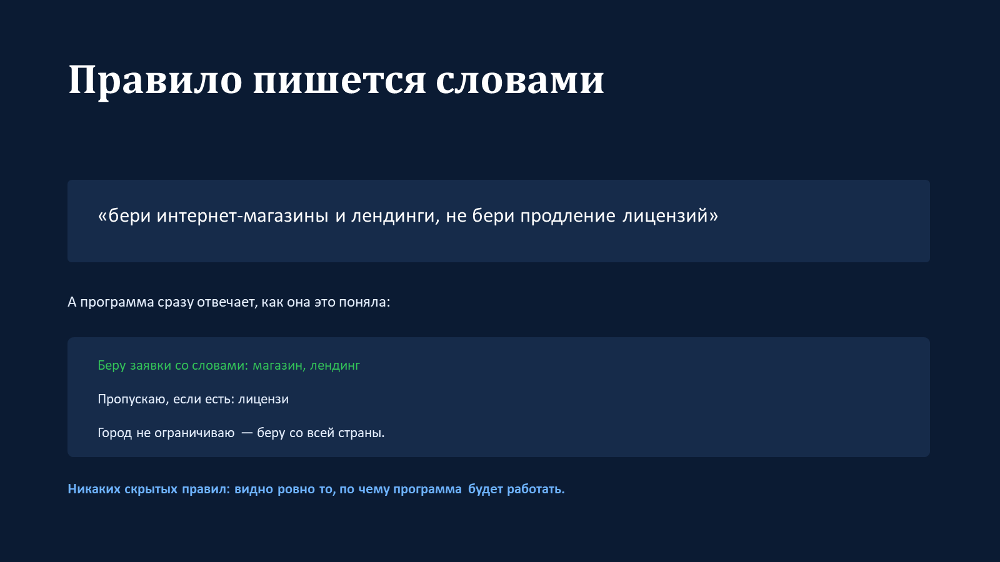
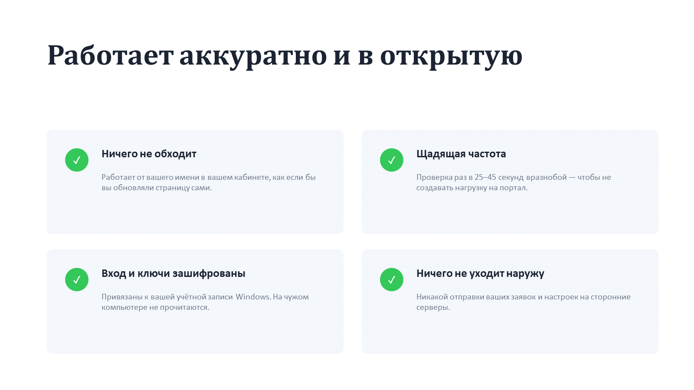
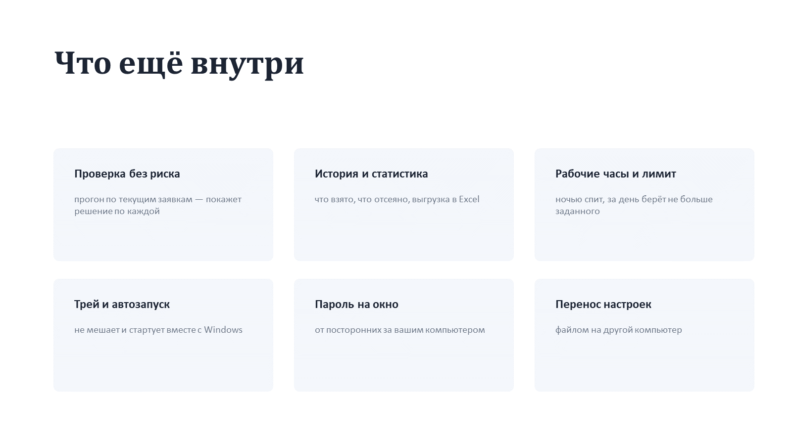
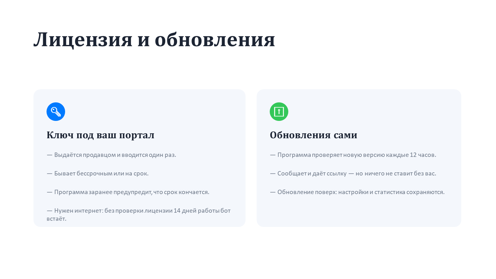
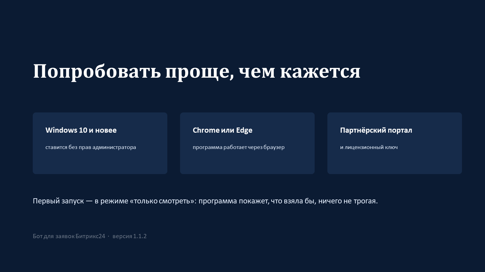

# Бот для заявок Битрикс24

Программа следит за партнёрскими заявками на портале Битрикс24 и берёт те,
которые подходят по вашим условиям. Работает от вашего имени в вашем кабинете,
круглосуточно и по правилам, которые вы задали словами.

**[Скачать последнюю версию](https://github.com/bgt29/app-status/releases/latest)** · текущая — 1.1.1

---

## Коротко о программе

*Программа следит за партнёрскими заявками и берёт подходящие*

*Заявку получает тот, кто успел первым*

*Что делает программа*

*Три шага до первой заявки*

*Вы решаете, кто отбирает заявки*

*Правило пишется обычными словами*

*Работает аккуратно и в открытую*

*Что ещё внутри*

*Лицензия и обновления*

*Как начать*

---

## Инструкция

[Instrukciya-po-botu.docx](Instrukciya-po-botu.docx) — установка, настройка отбора и раздел «если что-то
пошло не так». Написана для версии 1.1.1.

Презентация одним файлом: [Prezentaciya-bot-dlya-zayavok.pptx](Prezentaciya-bot-dlya-zayavok.pptx).

---

## Установка и обновление

Скачайте установщик со [страницы релизов](https://github.com/bgt29/app-status/releases/latest) и запустите — права
администратора не нужны.

Обновление ставится поверх прежней версии: настройки, вход на портал и
статистика сохраняются. Если нужно начать с чистого листа, на странице
«Дополнительные задачи» есть галочка «Чистая установка».

Программа сама проверяет, не вышла ли новая версия, но ничего не скачивает и не
устанавливает без вас.

**Для работы нужен лицензионный ключ** — он выдаётся отдельно.

---

## Что в этом репозитории

Исходного кода программы здесь нет — только то, что она читает, и документы:

| Файл | Зачем |
|---|---|
| `version.json` | номер последней версии и ссылка на скачивание |
| `revocations.json` | подписанный список отозванных лицензионных ключей |
| `Instrukciya-po-botu.docx` | инструкция пользователя |
| `Prezentaciya-bot-dlya-zayavok.pptx` | презентация |

Архивы «Source code», которые GitHub прикладывает к каждому релизу, — это
снимок именно этих служебных файлов, а не кода программы.
